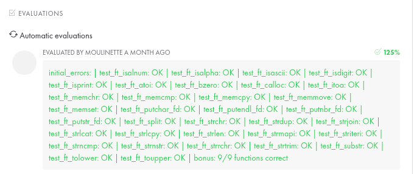

# Libft

O projeto Libft consiste em recriar algumas funções padrões existentes em C (`libc`). Como nos projetos da 42 são proibido usar algumas funções padrões do C, esse projeto foi pensado para que desenvolvessemos as nossas próprias funções e a usemos no futuro.


##### Principais aprendizados:

- Debug code foi a habilidade que mais aprendi nesse projeto

- Resiliência foi importante

- Aprendi a me organizar e dividir o projeto em etapas
- Aprendi o famoso RTFM :mega:

No bonus eu aprimorei meu conhecimento em estrutura de dados.

---

##### Technical considerations

- It is forbidden to declare global variables.
- If you need subfunctions to write a complex function, you should define these subfunctions as `static` to avoid publishing them with your library. It would be a good habit to do this in your future projects as well.
-  Submit all files in the root of your repository.
-  It is forbidden to submit unused files.
-  Every .c must compile with flags.
-  You must use the command ar to create your library, using the command libtool is forbidden.

---

##### Bonus

If you completed the mandatory part, you’ll enjoy taking it further. 

You can see this last section as Bonus Points. Having functions to manipulate memory and strings is very useful, but you’ll soon discover that having functions to manipulate lists is even more useful.

---




---

Execução:

```shell
make
```

Execução bonus:

```shell
m
```

